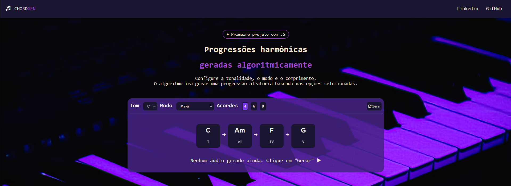

# 🎵 ChordGen

Gerador automático de progressões harmônicas, construído com Python (Flask)
no backend e HTML/CSS/JavaScript puro no frontend.

🔗 **Acesse o site:** [link do Render aqui]



---

## Sobre o projeto

O ChordGen gera progressões harmônicas com base na teoria musical. Você
escolhe o tom, o modo (Maior, Menor Natural ou Menor Harmônico) e a
quantidade de acordes (4, 6 ou 8), e o algoritmo monta uma progressão
coerente, mostrando a cifra de cada acorde e seu grau na escala (I, IV,
V, vi...). Também é possível ouvir o resultado direto no navegador.

Esse projeto nasceu como um gerador em Python com Streamlit. Decidi
reconstruí-lo do zero como um mini site (Flask + HTML/CSS/JS puro) como
forma de sair da minha zona de conforto e aprender front-end na prática,
sem depender de frameworks prontos.

## Desafios enfrentados

Esse foi meu primeiro projeto usando JavaScript puro, então grande parte
do trabalho foi aprender fazendo. Alguns pontos que mais me desafiaram:

- **Assincronismo**: entender como o `fetch` busca dados do backend Flask
  sem travar a página, e só atualizar a tela depois que a resposta chega.
- **Manipulação do DOM**: montar os cards de acorde dinamicamente com
  `createElement`/`appendChild`, em vez de já ter o HTML pronto.
- **Estilização de elementos nativos**: customizar os `<select>` de Tom e
  Modo (removendo a aparência padrão do navegador com `appearance: none`
  e criando uma seta customizada via SVG em Data URI) sem perder a
  funcionalidade nativa.
- **Depuração de bugs sutis**: por exemplo, uma comparação que checava se
  um grau (string) estava dentro de uma lista de notas MIDI (números) —
  parecia funcionar, mas sempre caía no mesmo resultado errado.
- **Layout com Flexbox**: alinhar os cards de acorde e o painel de
  configuração pra ficarem fiéis ao design original do Figma, mesmo com
  quantidades diferentes de acordes.

## Stack técnica

**Backend**
- Python + Flask
- Rota `/gerar` recebe tom, modo e quantidade via query string e retorna
  um JSON com o MIDI da progressão (em base64), a lista de cifras e os
  graus harmônicos
- `MIDIUtil` para montar o arquivo MIDI em memória (`io.BytesIO`), evitando
  colisão entre requisições simultâneas
- `gunicorn` como servidor de produção

**Frontend**
- HTML, CSS e JavaScript vanilla, sem frameworks
- `fetch` (async/await) para consumir a rota `/gerar`
- Renderização dinâmica dos cards de acorde via manipulação do DOM
- [`html-midi-player`](https://github.com/cifkao/html-midi-player) para
  reproduzir o áudio da progressão direto no navegador, usando o
  soundfont `sgm_plus` do Google

**CDNs / recursos externos**
- [Font Awesome](https://fontawesome.com/) — ícones (navbar, botão "Gerar")
- [Google Fonts](https://fonts.google.com/) — JetBrains Mono (elementos
  técnicos) e Inter/Space Grotesk (títulos)
- `html-midi-player` via CDN — componente Web Component que renderiza o
  player de áudio
- Soundfont `sgm_plus` (Google) — usado pelo `html-midi-player` pra
  sintetizar o som dos acordes no navegador

## Como rodar localmente

```bash
# Clone o repositório
git clone https://github.com/Tyr222/Chord_gen.git
cd Chord_gen

# Crie e ative um ambiente virtual
python -m venv venv
venv\Scripts\activate      # Windows
source venv/bin/activate   # Linux/Mac

# Instale as dependências
pip install -r requirements.txt

# Rode o servidor
flask run
```

Depois é só acessar `http://127.0.0.1:5000` no navegador.

## Próximos passos

- Integrar geração de progressões com IA, buscando resultados mais
  coerentes musicalmente
- Explorar o uso do Claude Code no desenvolvimento do projeto

## Licença

Este projeto está sob a licença MIT.
